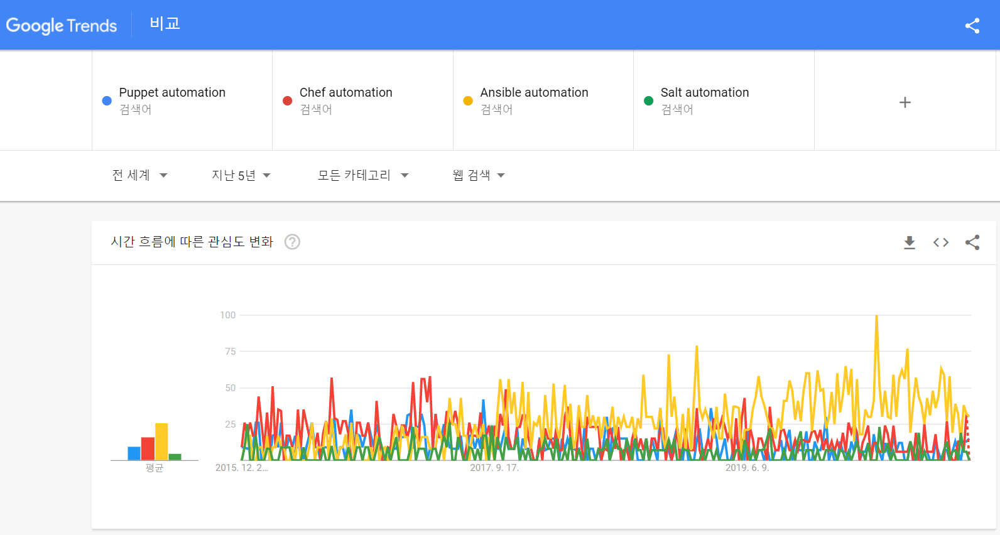
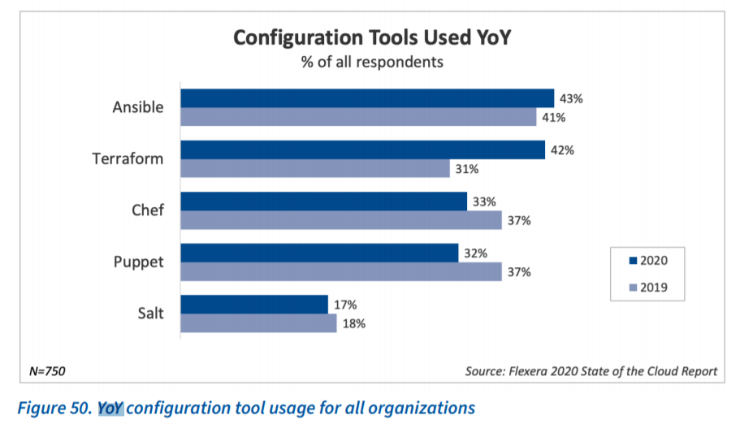
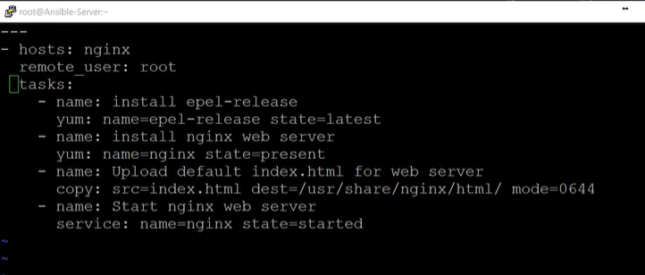

# Devops with Ansible

## 데브옵스?

- 개발과 운영이 순환구조를 이루면서 빠르게 적용되고 배포된다. 
- 많은 데브옵스 툴들이 수행에 필요한 자원을 획기적으로 줄여줌

##  Configuration Management Tool

- 구성관리툴의 4대천왕
    - 퍼펫, 쉐프, 엔서블, 솔트

- 4대 천왕 비교(기술적 비교 구체적으로 알아보기)

- 퍼펫
    - 가장 먼저나와서 도입한 회사가 많음
    - 구글, 이베이..
    - 기존 유저는 많이 찾음
    - 기술적으로 복잡도가 높음(얼만큼?)
- 쉐프
    - 퍼펫과 유사한 방식으로 기술적 복잡도 높음
    - 페이스북..
- 솔트
    - 정보량 적음, 발전속도 더딤

- 엔서블   
    - agent 설치가 필요없음. -> 기술적 복잡도 낮음
    - yaml 으로 쓰는 정의파일 구성이 퍼펫이나 쉐프보다 훨씬 쉬움
    - 신규 도입의 경우 많이 사용함
    - 정보량 많음 
    - 윈도우에서는 엔서블을 설치할 수는 있지만 다른 노드를 관리할 수는 없음.
    - 명령어가 굉장히 readable
        - `ansible all -m yum -a "name=httpd state=present" -k`
    - evernote..

- 지난 5년간 관심도 (from 구글 트렌드)

    - https://trends.google.com/trends/explore?date=today%205-y&q=Puppet%20automation,Chef%20automation,Ansible%20automation,Salt%20automation
    

- 2020 현재 사용률 (from rightscale 2020 state of the cloud report)

- 2019 대비 사용 증가율 (from rightscale 2020 state of the cloud report)

    
    
- 현재 핫한건 엔서블인듯..

## 엔서블 코어

- 노드 host 들을 중앙 관리할 server 에만 설치함. 엔서블은 agent가 필요없어서 노드들에는 설치 안해도됨.

- 엔서블 코어가 설치된 server 에서 연결된 host 들에 대해 한꺼번에 shell 명령어를 주고 output을 볼 수 있네..

    - 이 사실 만으로도 server에서 **ansible 명령어 한번으로 연결된 노드들에 한꺼번에** 파일 전송도 하고 패키지도 설치하고 서비스도 디플로이 할 수 있겠는데..오 진짜 편하다
        - `ansible all -m copy -a "src=./tmp.file dest=/tmp"`

    - 사실 연결된 모든 노드에 한번에 shell cmd 던지고 하는 작업은 Xshell 등 다른 툴로도 가능하지만, 에러가 난다던가 하는 내용은 일일히 host 의 shell 창 띄워서 보고 확인해야함 
    
    - -> ansible은 server 에서 명령어 친 후 바로 연결된 모든 노드들의 결과를 한 번에 확인할 수 있고(error 가 발생하는 부분 등) 관리하는 노드들에 대해서 정합성(? 커맨드 주는동안 멈춘다던데 다시 알아보기)을 보장해줌 

- GUI 관리 툴
    - Ansible Tower

## 엔서블 Playbook

- 사용자가 원하는 내용을 미리 정의해둔것
- ex) 대량의 서버에 웹서비스 배포 및 가동해야할때
    - 1. 각 서버에 nginx 설치
    - 2. 어플리케이션 파일 전송
    - 3. 서비스 재시작
    - 1~3을 엔서블 playbook 에 넣고 실행할 수 있음
    - `ansible-playbook playbook_file.yml`

- 장점
    - 멱등성 : 같은 연산은 여러번 적용해도 결과가 달라지지 않음

## Reference
- [Google Trend](https://trends.google.com/trends/explore?date=today%205-y&q=Puppet%20automation,Chef%20automation,Ansible%20automation,Salt%20automation)
- [Rightscale 2020 state of the cloud report](https://resources.flexera.com/web/pdf/report-state-of-the-cloud-2020.pdf?elqTrackId=8e710f56b1c44fe39130b0d6168944ed&elqaid=5770&elqat=2)
- 인프런 [기초] 처음부터 설치하며 배우는 앤서블(Ansible)
