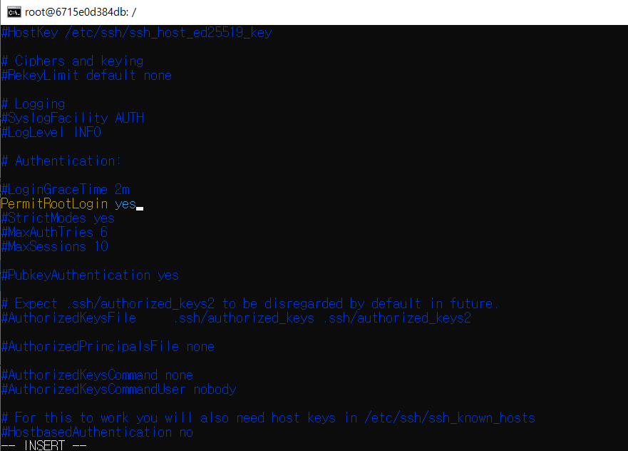
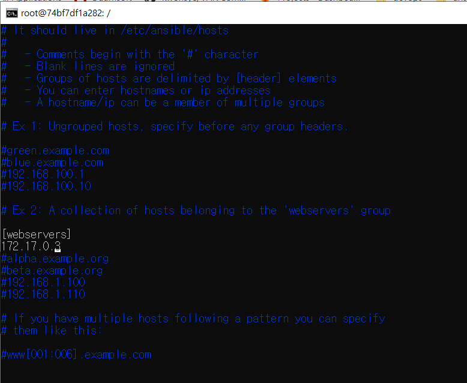
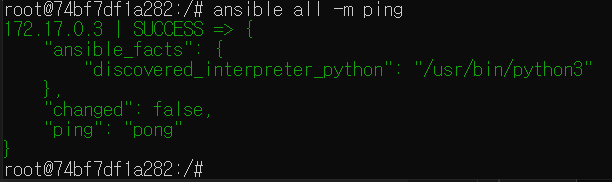
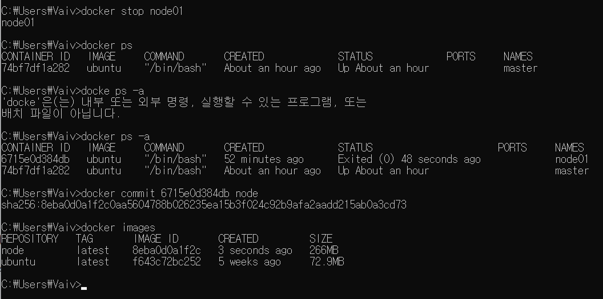
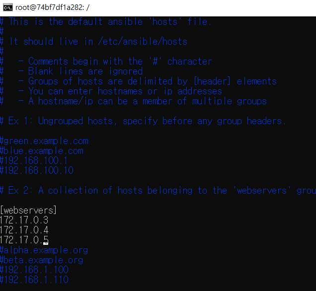
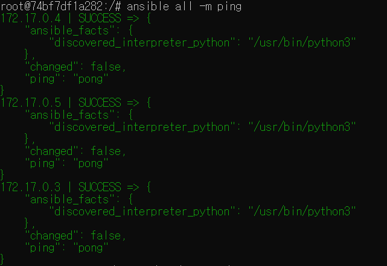

# Ansible 사용해서 스부 배포해보기

## 사전 작업 : 노드 구성하기

- 노드들을 먼저 준비해야하므로 virtualbox 등을 이용해서 vm 으로 만들어도 되지만, 귀찮으니 도커에다가 컨테이너들 띄울 예정.

- [Docker for Windows](https://docs.docker.com/docker-for-windows/)
    - 기본 설정대로 설치하고 재부팅했는데 WSL 업데이트하라고 해서 [WSL2 로 업데이트](https://docs.microsoft.com/ko-kr/windows/wsl/install-win10#step-4---download-the-linux-kernel-update-package)함

- 목표 
    - 마스터노드 1개, 나머지노드 3개

```
# 우분투 이미지 다운
docker pull ubuntu

# 마스터 노드 컨테이너 하나 띄우기
docker run -itd --name master ubuntu /bin/bash 

# 마스터 노드 안으로 접속
docker attach master 

# 마스터 노드에 필요한 기능 설치
apt update
apt install python ansible openssh-client vim iputils-ping -y

# 새로운 cmd 프로세스에서 node1 컨테이너 생성
docker run -itd --name node01 ubuntu /bin/bash

# node01 접속 후 필요한 기능 설치
docker attach node01
apt update; apt install ssh vim -y

# node01의 root 비밀번호 설정
passwd root

vim /etc/ssh/sshd_config # 아래와 같이 변경
```


```
# ssh service 재시작
service ssh restart
service ssh enable
service ssh start

# 실행 중인 컨테이너들의 private ip 보기
docker network inspect bridge

# master node 에서 ssh keygen 생성
ssh-keygen

# node01 로 copy
ssh-copy-id root@172.17.03
// yes 입력
// node01의 root 계정 패스워드를 입력

# master에서 node01로 접속 테스트
ssh root@172.17.0.3

# mater node containter 로 돌아와서 inventory 에 node01 추가
vim /etc/ansible/hosts 
```


```
# master에서 hosts 들에 ping 날려보기
ansible all -m ping
```


이제 같은 작업을 2 번 더 해서 node02, node03을 띄워볼까..


그러라고 있는 docker 가 아니지  
만들어놓은 `node01` 컨테이너를 image로 굽기

```
# 이미지 만들 컨테이너 멈추기
docker stop node01

# 멈춘 컨테이너 id 확인
docker ps -a

# 이미지 만들기
docker commit <이미지로 만들 컨테이너 id> <만들 이미지 이름>
```


```
# 멈춰놨던 컨테이너 rerun
docker start node01

# 구워놨던 이미지(나의 경우 node)로 node02, node03 생성
docker run -itd --name node02 node /bin/bash
docker run -itd --name node03 node /bin/bash

# ssh restart 작업은 각각 컨테이너에 들어가서 해준다.(이거도 도커파일 만들어서 이미지 만들면 되는데 지금 도커가 중요한게 아니니 일단..)
docker attach node01
service ssh restart
# tip : ctl + p + q 하면 attach 밖으로 나올 수 있음
docker attach node02
service ssh restart
docker attach node03
service ssh restart

# master node 에 hosts 추가
vim /etc/ansible/hosts
```



```
# 모든 노드들에 ping test
ansible all -m ping
```




#TODO
- copy vs synchronize