# 1st Research for DevOps

## 목표

- 서버 어플리케이션 코드를 추가,수정(update)할 경우, **모든 API 서버에 한 번에 deploy** 해보자.
- 서버의 설정값이 여기저기 혼재되어 있어서 관리가 힘든데, 가능하다면 **한 군데에서 일관성있는 관리**를 해보자.

## Solution

- `DevOps`의 필요성
    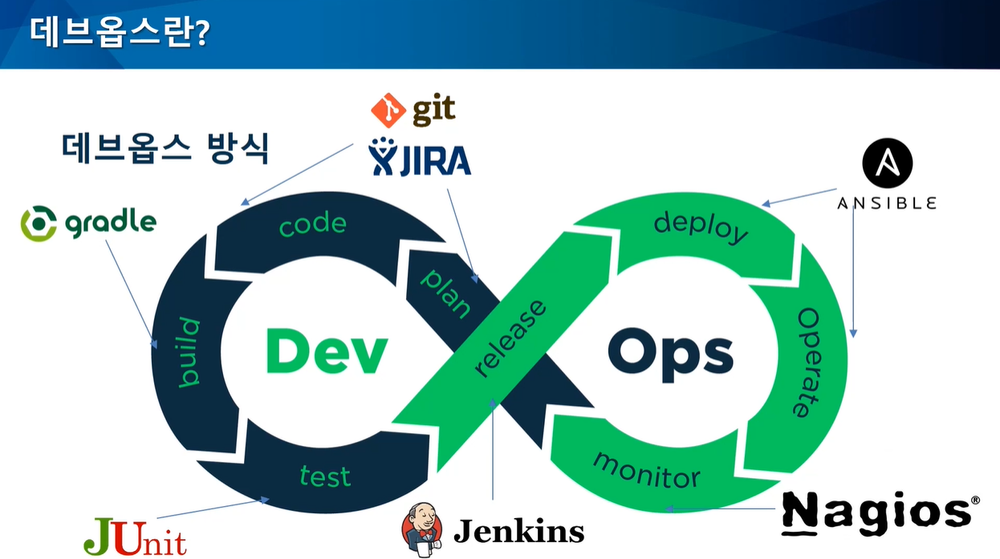
    - DevOps의 철학 (feat AWS)
        - Development + Operation 
        - **개발과 운영이라는 두 팀 간의 장벽을 없애서 개발자의 생산성과 운영의 안정성**을 최적화하자
        - 애플리케이션과 서비스를 **빠른 속도로 제공**할 수 있도록 개발자와 운영을 담당하는 전문가 사이의 소통, 협업, 통합 및 자동화를 강조
    - 실현 방식
        - 지속적 통합과 전달(`CI/CD`)
        - 코드형 인프라(`IaC`)
        - 모니터링 및 로깅
        - 커뮤니케이션 및 협업
        - 마이크로 서비스
    
- `IaC`의 필요성
    - 인프라도 소프트웨어처럼 개발하자 
    - **표준화된 인프라를 코드 기반으로 구성 및 업데이트**할 수 있다.
    - **인프라 환경의 약속된 표준화**
     - 다양한 환경에 대해 일관적이고 표준화된 관리가 가능
    - 인프라환경을 **어느누가 작업해도 일관성이 유지**될 수 있다.
    - 코드로 관리하기 때문에 인프라 변경에 대한 추적(형상관리)도 가능 ==  서버의 운영 기록을 코드화 ==  서버 운영 기록을 나중에도 재현 가능

- (더 나아가면) `Container` 의 필요성
    - 애플리케이션을 환경에 구애 받지 않고 이미지화해서 일관적이게 실행 가능

- (더 나아가면) `CD/CI`의 필요성
    - 애플리케이션의 통합,테스트,배포에 이르는 애플리케이션의 라이프사이클 전체에 걸쳐 지속적인 자동화와 지속적인 모니터링을 제공
    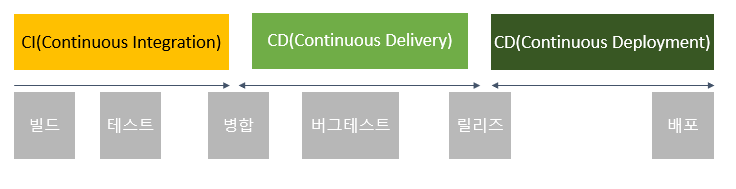
    - 개발중에 지속적으로 빌드와 유닛 및 통합 테스트를 진행하고, 이를 통과한 코드에 대하여 테스트서버와 운영서버에 자동으로 릴리즈

## DevOps Tool

- IaC(Infra as Code) Tool
    - DSL 코드로 서버의 상태를 정의하고 관리

    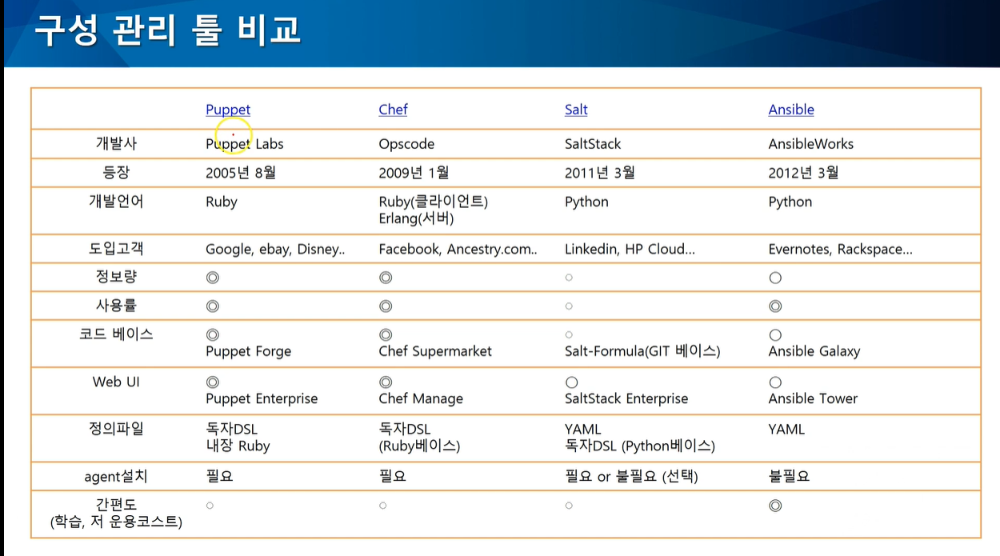

    - `Ansible`(developed by RedHat)
        - 특징
            - 지원 OS : Linux, Unix-like, MacOS, Windows
            - 최근 가장 많은 관심과 사용률
            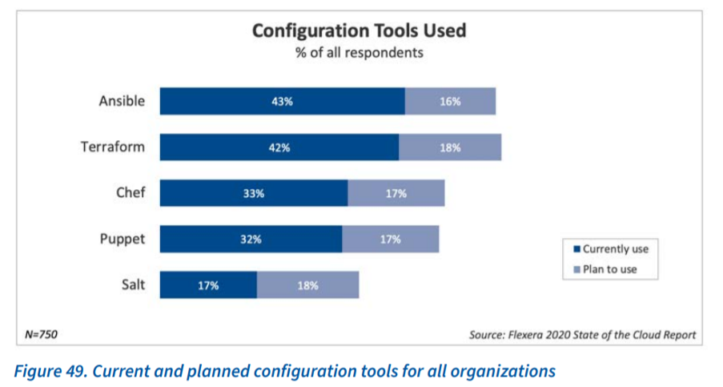
            - 신규 도입의 경우 많이 사용함
            - SSH 기반으로 Agent-less
            - 멱등성 : 같은 조작을 몇번이고 수행하더라도 같은 결과
            - 다양한 태스크를 실행하기 위해 수많은 모듈이 마련되어 있음
            - Push형 아키텍쳐 : master node -> client node
            - 하드웨어 사양(시스템 요구 사항)
                - (최소) CPU : Pentium4 / Memory : 2GB / Disk : 3.0GB/Linux Kernel 3.10
                - (권장) CPU : Dual Core / Memory : 4GB / Disk : 10.0GB/Linux Kernel 3.10

            - 활용 사례(TODO)
                - (네이버) Deview 2014, Ansible의 이해와 활용
                - 펜타시스템 테크놀로지
                - (카카오) 오픈스택과 Ansible 활용사례
                - 오픈 스택 기반 사설 클라우드
                - Toast

            - GUI 모니터링 툴
                - 제공 기능(tower에서는 확실히 지원되는 기능인데, awx 에서는?)
                    - dashboard
                    - 역할 기반 액세스 제어
                    - Job scheduling
                    - Multi-playbook workflow
                    - RESTful API
                    - 외부 로깅 통합
                    - 실시간 작업 상태 업데이트

                - `Ansible Tower (from redhat)` 
                    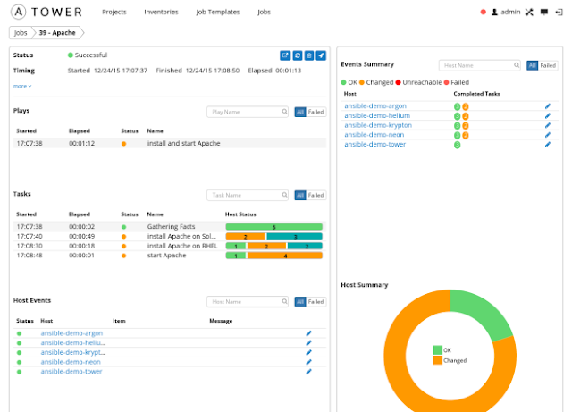
                    - 장점
                        - 레드헷에서 완전히 지원됨
                        - 출시 전에 품질 및 엔지니어링 문제에 대해 완전히 테스트 됨
                        - 완전한 엔터프라이즈 기능이 포함 된 10 노드 무료 라이센스 제공
                        - 설치 / 업그레이드가 잘 문서화되고 지원됨
                    - 단점
                        - 상업용 유료제품임. 비쌈
                            ```
                            standard trial -연간 $ 13,000, 최대 100 개의 노드, 8x5 지원
                            premium trial - 연간 $ 17,500, 최대 100 개의 노드, 연중 무휴 지원
                            100 노드 이상시 $5,000/year 비용 발생...
                            ```
                - `AWX (opensource)`
                    - ansible tower 의 오픈소스 버전.ansible 을 GUI 로 관리하고, api 로 제어할 수 있도록 해주는 시스템.
                    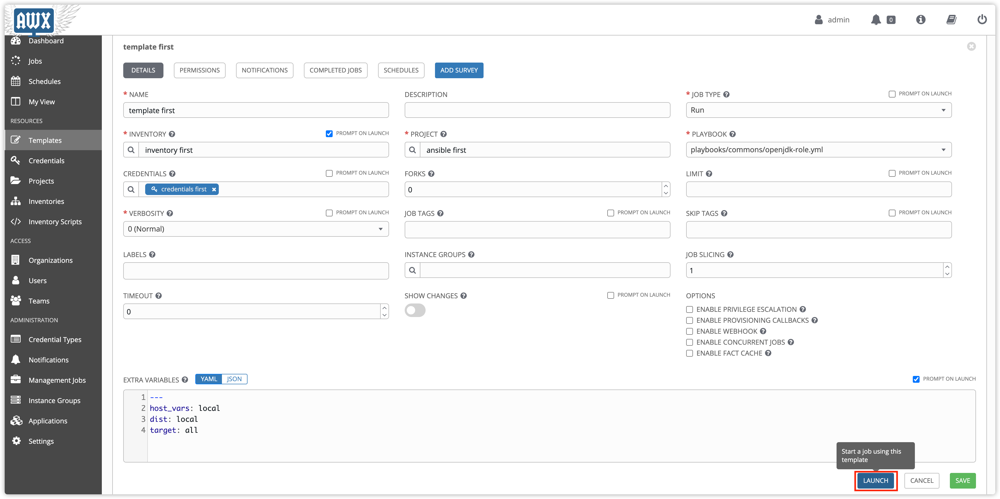
                    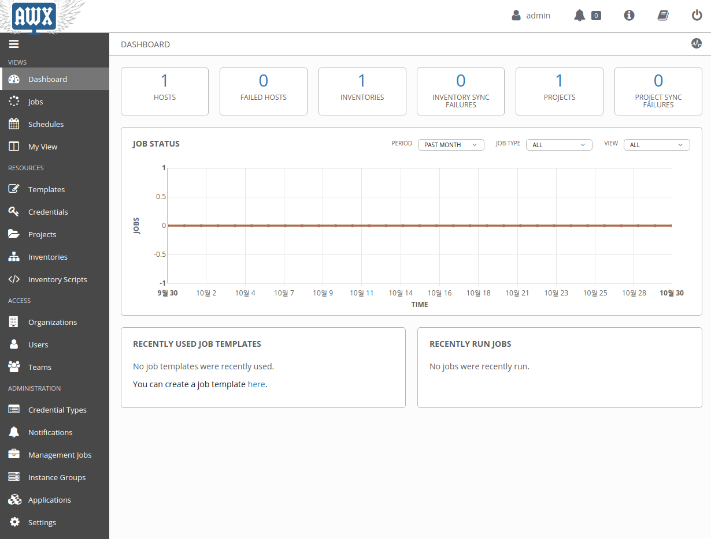
                    - 장점
                        - 노드 제한 없이 오픈소스라 무료
                        - Ansible Tower의 모든 기능을 사용할 수 있음
                    - 단점
                        - 반드시 docker 위에서 돌아가야함
                        - 공식적으로 지원되지는 않음
                        - 하루에 여러번 릴리즈될 수 있음
                        - Ansible Tower release 와 완전히 동기화를 기대하긴 어려움
                    

        - 장점
            - agent 설치가 필요없어서 기술적 복잡도 낮음(<-> `Chef`, `Puppet` 은 클라이언트 프로그램을 호스트에 설치필수)
            - SSH / winRM 연결 방식은 다른 모델과 비교하여 안전
            - yaml 으로 쓰는 정의파일 구성이 퍼펫이나 쉐프보다 쉬움
            - 레퍼런스가 많음
            - 명령어가 readable

        - 단점
            - SSH 통신 속도
            - 윈도우에서는 엔서블을 설치할 수는 있지만 다른 노드를 관리할 수는 없음.
            - DSL(Domain-Specific Language) 을 통해 로직을 수행하여 학습이 필요

        - 가격
            ```
            free open source version
            ```

    - `Chef`
        - 특징
            - 루비(Ruby)로 구현되어있고
            - 루비로 코드 작성해야함 (Recipe라고 함)
            - Pull형 아키텍쳐
                - agent 가 master 서버에 접근해 코드를 가져온 다음, 에이전트 스스로가 해당 머신에 적합한 상태 설정
                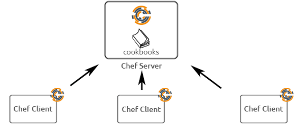
        - 장점
            - 풍부한 모듈 및 구성 레시피
            - 프로그래밍이 가능
            - Community 및 문서 풍부
            - 대규모 배포에 안정적
            - Git을 중심으로 강력한 버전 제어 기능을 제공
        - 단점
            - Ruby 및 절차적 코딩 이 필요하여 러닝커브 높음
            - 초기 설정이 복잡
            - 대규모 코드 기반과 복잡한 환경이 발생한다.
            - pull-based 방식

        - 가격:
            ```
            free open source version
            standard plans: $6/node/month
            premium plans: $6.75/node/month
            ```


    - `Puppet`
        - 특징
            - 루비(Ruby)로 구현
            - Pull형 아키텍쳐
                - agent 가 master 서버에 접근해 코드를 가져온 다음, 에이전트 스스로가 해당 머신에 적합한 상태 설정

        - 장점
            - Puppet Labs를 통해 잘 구성된 지원 커뮤니티
            - 대규모 인프라 관리를 위해 매우 안정적
            - 가장 성숙한 인터페이스를 갖추고 거의 모든 OS에서 실행된다
            - 간단한 설치 및 초기 설정
            - 강력한 보고 기능

        - 단점
            - 고급 작업을 위해서는 Ruby 기반 CLI 사용해야 한다
            - 독자적인 언어 사용해서 Mainfest 작성해야함(Puppet의 맞춤형 DSL을 사용을 권장,순수한 Ruby 버전에 대한 지원 축소) -> 러닝커브 높음
            - 실행 대상 전용 agent를 설치해야하는 단점, agent를 도입하기 위한 준비가 필요
            - pull-based 방식
        
        - 가격
            ```
            free open source version
            paid commercial enterprise version: $112/node/year
            ```

    - `Terraform`(HashiCrop)
        - 특징
            - HCL를 사용해 인프라스트럭처를 코드로 정의
            ```
            resource "aws_instance" "bastion" {
                ami = "${ var.ami_id }"
                instance_type = "${ var.type }"
            }
            ```
            - 클라우드의 가상화된 리소스를 관리(클라우드 서버 인스턴스를 생성하고 클라우드 db 와 연결하고 구성한다던가...등등)
            - on-premise 물리적 장비는 대상이 아님
            - IaaS 클라우드 환경의 provider로 인프라를 프로비전 해야하는 경우에만 적합
            - 다양한 프로바이더를 지원 AWS, GCP, Azure
            
- Container Tool
    - `Docker`
        - 특징
            - 컨테이너를 이용한 가상환경 플랫폼
            - 설정된 값을 **이미지(설정)** 로 구성해서 **컨테이너(실행환경)** 에서 실행할 수 있다.
            - 어느 환경이나 동일하게 작동
            - Docker Web UI 관리툴
                - `Portainer`
                    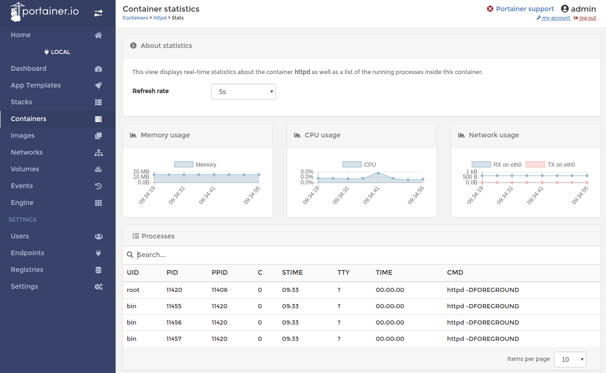
                    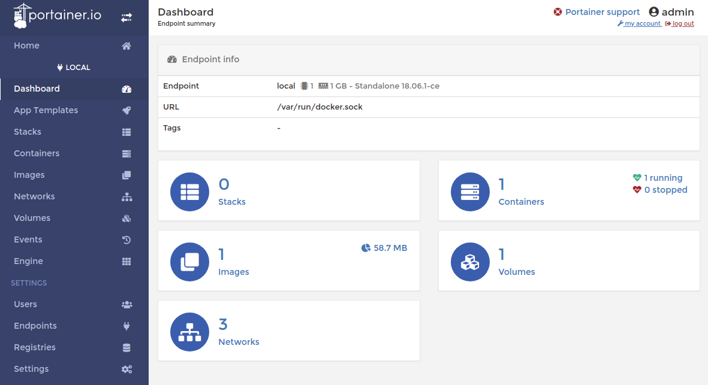
                    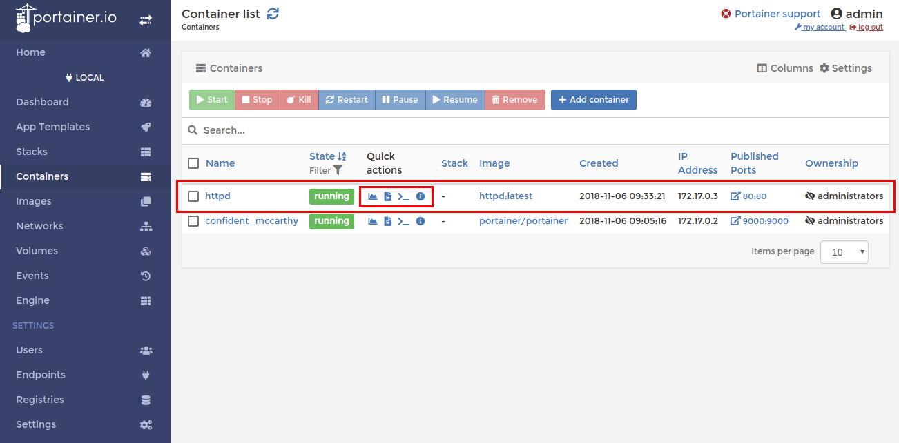
                    - 오픈소스,무료
                    - Docker CLI 기능 지원 : Start/Stop/Delete 등
                    - Docker Container 별 리소스 모니터링 / 로그 분석 등 기능
                    - Docker Container 별 실행 Shell 지원

        - 장점
            - 이미지를 한번 생성해 놓으면 간편하게 **동일한 환경을 쉽게 재현 가능**
            - 웹서버 환경 구축과 같은 **반복적인 설정작업을 간단하게 작업 가능**
            - 테스트나 롤백도 쉽다
            - 하드웨어를 가상화하지 않으므로 메모리 엑세스, 파일 시스템, 네트워크 실행 성능 향상

        - 단점
            - 리눅스만 사용가능
            - 도커는 대규모의 프라이빗 클라우드나 퍼블릭 클라우드에 쓸모가 있다..?

    - cf) IaC(Ansible) vs Container(Docker)
        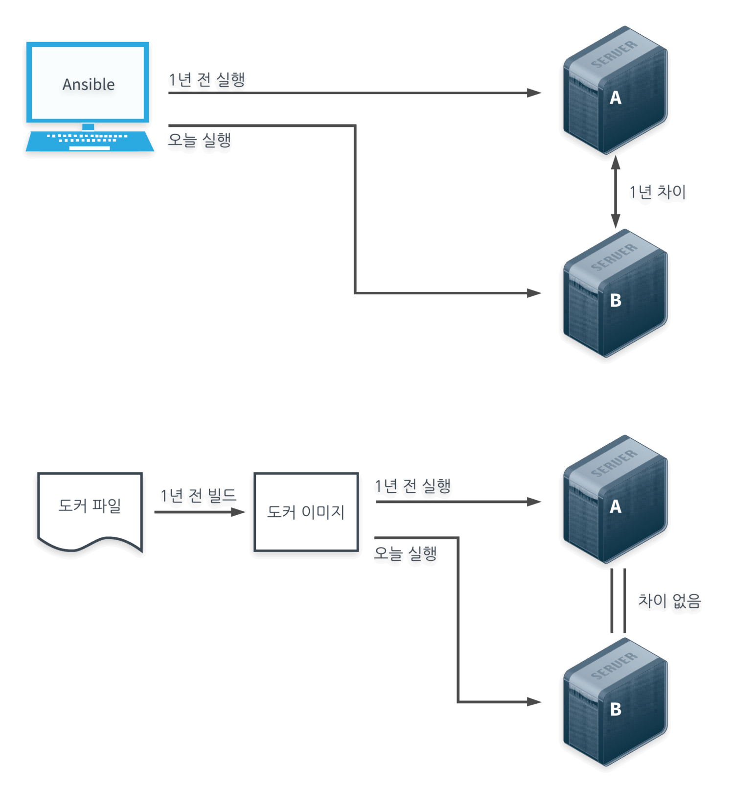
        - 디펜던시를 설치해야하는 일을 동일하게 한다면
        - IaC는 운영 코드를 기록해놓는 것이기 때문에 코드 실행 시점의 디펜던시가 설치됨
        - 컨테이너는 **실행 시점에 상관 없이 구성 시점을 고정할 수 있음**

    - Container Orchestration Tool
        - `Docker Swarm`, `쿠버네티스`

- CD/CI Tool
    - `Jenkins`
        - 장점
            - 오픈 소스, 무료
            - 많은 플러그인, 지원하는 기능이 풍부하고, 다양하다 (알림의 종류, 다양한 IDE 지원, 커스터마이즈 등이 다양하다.)
            - 무료라서 대부분의 많은 회사에서 주로 사용하는 도구(ex 우형 등) => 다양한 적용사례 및 풍부한 레퍼런스
            - 사용자 정의 옵션

        - 단점
            - 트래비스와 달리 설치형이라서 젠킨스 자체를 관리하는 것도 하나의 일이 될 수 있다.
            - 젠킨스용 서버가 따로 필요(도커로 띄울수도 있음)

    - `Travis CI`
        - 장점
            - 다양한 레퍼런스가 많고, 오픈소스 등에서 많이 사용하는 보편적인 CI 도구
            - 다양한 언어를 지원하며, Github와 연동이 편리하다.
            - 트래비스 자체에서 호스팅을 해주기 때문에 관리 측면에서 편리하다.
            - AWS랑 얼마나 죽이 잘 맞는다
        - 단점
            - 젠킨스에 비해 자유도가 낮고, 기능이 아직은 부족 (젠킨스의 플러그인과 같이 다양하지 않음.)
            - 월 비용이 만만치 않다. (기본 월 69$, 보통 일반적으로 사용하는 것은 월 129$)

## Solution Flow

- 아직 정확히 모르겠지만 대충 그려본 그림

### 첫 번째 flow

- 새 배포 버전 코드 커밋할때마다 앤서블 Playbook 실행을 통해 모든 서버에 배포

### 두 번째 flow
0. API 서버들의 최초 구성은 앤서블
1. 새로운 버전을 commit 하면 Jenkins 툴에서 자동으로 변경사항 테스트
2. 바뀐 버전을 도커 이미지로 만들어서 저장
3. 젠킨스로 테스트한 버전을 배포 서버에 배포

### 참고할 flow
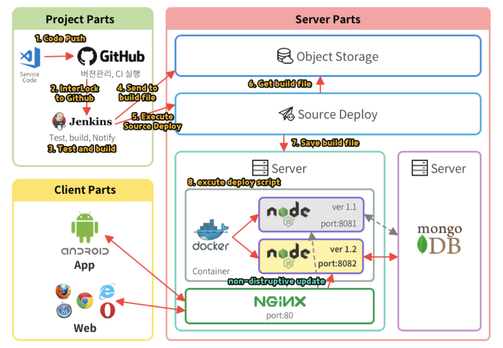
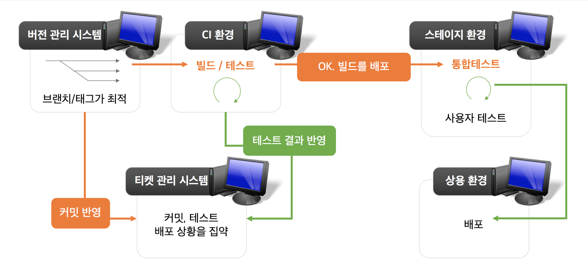

<br>

## 회고

- 처음에는 기존의 목표를 달성하기 위한 방향을 위한 많은 툴들을 찾아보는 것으로 시작했는데, 공부하다보니 너무 빌드,테스트, 운영 자동화, 컨테이너 가상화로 빠진 것 같았습니다.

- 처음부터 너무 큰그림으로 완벽하게 구축하려 하지 말고, 일차적으로 목표를 이루는 방향으로 문제를 작게 쪼개서 생각해봐야할 수도 있을 것 같습니다..다른 큰 회사들도 데브옵스를 구축하는데 몇 개월씩 걸렸다고 하니, 큰 그림을 한번에 적용시키려는 무리일 수 도 있을 거라는 생각이 들었습니다.

## Reference

- https://aws.amazon.com/ko/devops/what-is-devops/
- https://www.44bits.io/ko/post/why-should-i-use-docker-container
- https://tech.gamevilcom2us.com/blog/3597
- https://devuna.tistory.com/56
- https://forteleaf.tistory.com/entry/ansible-%EC%9E%90%EB%8F%99%ED%99%94%EC%9D%98-%EC%8B%9C%EC%9E%91
- https://mrsence.tistory.com/63 
- https://zzsza.github.io/development/2019/03/15/terraform/
- https://elfinlas.github.io/2019/08/14/ci-tool/
- https://woowabros.github.io/experience/2018/06/26/bros-cicd.html
- https://www.oss.kr/info_sp/show/fb59bc4b-6c65-4504-a2d5-54131181a05c
- https://meetup.toast.com/posts/258
- https://help.iwinv.kr/manual/read.html?idx=548
- https://sysnet4admin.blogspot.com/2017/06/ansible-gui-7.html#.X_KAhNgzZPY
- https://engineering.linecorp.com/ko/blog/ansible-awx-for-provisioning-1/
- https://engineering.linecorp.com/ko/blog/ansible-awx-for-provisioning-1/