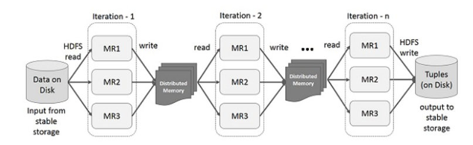

# Spark✨ 개념 톺아보기

## 스파크의 핵심은 무엇인가

- **Spark = RDD + Interface**
- RDD를 알아야 Spark를 아는거다.
- RDD?
    - **Resilient Distributed Data**
    - 스파크 내에 여러 **분산 노드에 걸쳐서 저장되는 immutable 한 데이터의 집합**
    - 각각의 RDD는 **키를 기반으로** 덩어리(Chunk) 단위로 쪼개져 있고 실행 노드(Executor Node)로 분산됨 -> 데이터셋에 대한 연산 속도 빠름
    - 병렬로 동작
    - RDD라고 무조건 메모리에만 상주하는게 아니다. 시간이 지나면 날라감. 다시 필요하다면 리니지를 가지고 다시 만듦 == **탄성력 Resilient**

    - RDD에서 지원하는 딱 두가지 Operation
        - ***Transformation***
            - 기존의 RDD를 변경해서 새로운 RDD를 생성하는 것
            - RDD를 필터링하거나 변환하여 새로운 RDD를 리턴
            - filter, map, sort, join etc.
        - ***Action***
            - RDD 값을 기반으로 계산해서 결과를 생성해내는 것
            - count, collect, save etc.
        - 보통 RDD 데이터에 대한 Trans -> Trans -> Trans -> ... -> Action

    - 데이터 손실이 발생했을 때 대비책을 제공하기 위해 **RDD는 각각 덩어리에 적용된 모든 트랜스포메이션을 추적**

- RDD의 데이터로딩 방식

    - ***Lazy Loading & Lazy Execution***
        - 모든 Transformation은 데이터셋에 대한 **Action이 호출됐을 때 그제서야 Lazy하게 데이터를 로딩하고 execution**
        - Transformation 중에 실제 계산은 일어나지 않음. Transromation 중에는 아무 일도 안생김.
        - 미리 메모리에 RDD를 올려놓는게 아니라 action수행시 필요한 부분만 메모리에 올리면 filter 등으로 **정제된 적은 양의 데이터만 메모리에 올린다.**
        - 로딩된 데이터는 언제 지워질까?
            - **action을 수행한 다음 바로** 지워진다.

 

## Spark 는 어떻게 동작하는가🤔

- 각 iteration 돌 때마다 **데이터를 RAM에 올려놓고** 사용해서 IO시간을 줄이자  

    - ***MR + HDFS***
      

    - ***Spark + RDD***
      

- Fault tolerant & Efficient 하게 램을 사용해보자
    - ***RAM 을 read-only 로만 사용하자 == RDD 개념 등장***
    - RAM에 올린 데이터를 **immutable하게** 유지!
    - 어떻게 transform 되는지 **계보만 기록**해두면 fault tolerant 가능
    - **transform 중에 실제로 계산 작업이 이뤄지는게 아니라 계보를 기록해 나가기만** 하고 아무일도 안생김
    - 계보를 그려놓은 상태에서 나중에 action으로 execution하므로 **자원이 배치된, 배치될 상황을 미리 고려해서 최적 코스로 plan을 짤수도!**

- 수행 중 메모리가 부족하다면?
    - LRU(Least Recently Used) 알고리즘으로 **캐시처럼 안쓰는 파티션 날림**

- 수행 중 Fault나면?
    - **기록해둔 계보 로그를 보고** Fault나면 **다른 노드에서 다시 땡겨서 복구**
    - wide dependency의 경우 Fault 후 재계산을 통한 비용이 크다면 **디스크에 check pointing** 해놓을 수도 있다.

 

## Spark의 성능?😎

- IO intensive, CPU intensive 모두 Hadoop에 비해 빠르고 좋다.
- 머신 개수가 늘어도 Hadoop에 비해 빠르고 좋다.
- 스파크가 짱인듯

 

## Reference

- https://www.slideshare.net/yongho/rdd-paper-review
- https://bcho.tistory.com/1027
- https://12bme.tistory.com/306
- https://www.tutorialspoint.com/apache_spark/apache_spark_rdd.htm