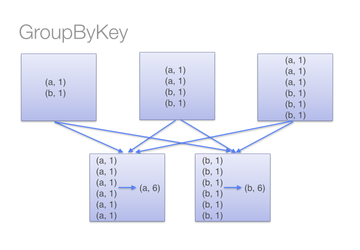

# Spark✨ 실습해보기

```python
from pyspark import SparkContext

sc = SparkContext()

type(sc)  # sparkcontext 타입 확인하기

dir(sc)  # sparkcontext 함수와 attribute 리스트 확인하기

help(sc)  # sparkcontext 도움말 보기

sc.version # sparkcontext 버전 확인하기

data = range(1, 10001) # 1부터 10000까지의 숫자 리스트 생성.

rangeRDD = sc.parallelize(data, 8) # 해당 데이터를 8개의 파티션으로 나눔

print('type of rangeRDD: {0}'.format(type(rangeRDD))) # type of rangeRDD: <class 'pyspark.rdd.RDD'>  

rangeRDD.getNumPartitions() # 8 / 해당 RDD의 파티션 숫자 확인                                      

print('rangeRDD id: {0}'.format(rangeRDD.id())) # rangeRDD id: 0 / RDD id 확인

rangeRDD.setName('My first RDD') # RDD 에 이름 지정

def sub(value):
    return (value - 1)

subRDD = rangeRDD.map(sub) # map() : transformation / RDD에 sub 함수를 적용시킨다.

subRDD.collect() # [0, 1, 2, 3 ... 9999] / collect() : action

print(rangeRDD.count()) # 10000 / count() : action

print(subRDD.count()) # 10000

def ten(value):
    if(value < 10):
        return True
    else:
        return False

filteredRDD = subRDD.filter(ten) # filter() : transformation / True 인 element만 filter됨

print(filteredRDD.collect()) # [0, 1, 2, 3, 4, 5, 6, 7, 8, 9]

# lambda 함수 이용

lambdaRDD = subRDD.filter(lambda x:x < 10)
lambdaRDD.collect() # [0, 1, 2, 3, 4, 5, 6, 7, 8, 9]

evenRDD = lambdaRDD.filter(lambda x: x % 2 == 0)
evenRDD.collect() # [0, 2, 4, 6, 8]

# 기타 actions

print(filteredRDD.first()) # 0 / first() : action 첫 번째 data만 가져오기

print(filteredRDD.take(4)) # [0, 1, 2, 3] / take() : action 해당 개수만큼 가져오기

print(filteredRDD.takeOrdered(4, lambda s: -s)) # [9, 8, 7, 6] / takeOrdered() : action 해당 개수만큼 데이터를 가져오는데 정렬해서 가져온다. (오름차순, 내림차순)

print(filteredRDD.top(4, lambda s:-s)) # [9, 8, 7, 6] / top() : action takeOrdered()와 비슷.

from operator import add

print(filteredRDD.reduce(add)) # 45 / reduce() : action 계산된 결과를 하나의 값으로

print(filteredRDD.reduce(lambda a,b:a+b)) # 45

print(filteredRDD.reduce(lambda a,b,:a-b)) # -45

print(filteredRDD.repartition(4).reduce(lambda a,b:a-b)) # -45

print(filteredRDD.repartition(4).reduce(lambda a,b: a+b)) # 45

print(filteredRDD.takeSample(withReplacement=True, num=6, seed=500)) # [8, 5, 5, 9, 7, 2] / takeSample() : action 랜덤으로 원소들을 리턴 / withReplacement 파라미터가 있는데 True일 경우 동일한 원소가 여러번 리턴될 수 있다

repetitiveRDD = sc.parallelize([1,2,3,1,2,3,1,2,1,2,3,3,3,4,5,4,6])

print(repetitiveRDD.countByValue()) # defaultdict(<type 'int'>, {1: 4, 2: 4, 3: 5, 4: 2, 5: 1, 6: 1}) / countByValue() : action 값으로 그룹화 한 후 그 개수를 count

# map() 과 flatmap() : transformation
wordsList = ['cat', 'elephant', 'rat', 'rat', 'cat']

wordsRDD = sc.parallelize(wordsList, 4)

singularAndPluralWordsRDDMap = wordsRDD.map(lambda x: (x, x+ 's'))

print(singularAndPluralWordsRDDMap.collect()) #[('cat', 'cats'), ('elephant', 'elephants'), ('rat', 'rats'), ('rat', 'rats'), ('cat', 'cats')]

singularAndPluralWordsRDDMap = wordsRDD.flatMap(lambda x: (x, x+ 's'))

print(singularAndPluralWordsRDDMap.collect()) #['cat', 'cats', 'elephant', 'elephants', 'rat', 'rats', 'rat', 'rats', 'cat', 'cats']

import math

pairRDD = sc.parallelize([('a',1), ('a',2), ('b',1)])

print(pairRDD.groupByKey().mapValues(lambda x: list(x)).collect()) # [('a', [2, 1]), ('b', [1])] / groupByKey() : action 모든 key-value 쌍이 셔플, 네트워크 상에서 불필요한 데이터 전송을 야기

print(pairRDD.reduceByKey(add).collect()) # [('a', 3), ('b', 1)] / reduceByKey() : action pair RDD로 이루어져 있는 경우에 적용 가능, 대규모 분산 dataset에 대해 매우 효과적으로 동작. 그 이유는 node를 통해 data 셔플이 일어나기 전에 각각 파티션에서 키를 통해 출력 데이터를 결합할 수 있기 때문.

# 캐싱
filteredRDD.cache()

print(filteredRDD.is_cached) # True

filteredRDD.unpersist() # 메모리에 caching 해제

print(filteredRDD.getStorageLevel()) # Serialized 1x Replicated / RDD가 현재 어느 위치에 저장되어 있는지(메모리 or disk) 보여준다.

filteredRDD.cache() # 다시 캐시

print(filteredRDD.getStorageLevel()) # Memory Serialized 1x Replicated
```  

<br>

- `reduceByKey()` vs `groupByKey()`  

      

      

- RDD 캐싱
    - 메모리는 제한적이기 때문에 너무 많은 메모리가 저장되어 있으면 **spark에서는 자동적으로 RDD를 삭제**

    - `cache()` 함수를 통해 만들어진 RDD를 **메모리에 상주** 시킬 수가 있다. 너무 많은 RDD를 메모리에 상주시키면 **가장 적은 빈도로 사용했던(LRU) RDD 부터 삭제를** 시작
    
    - spark는 자동으로 RDD를 관리하고 **메모리가 꽉차면 disk로 swap**
    
    - 가장 효율적인 방법은 RDD 사용을 끝냈으면 `unpersist()` 함수를 써서 RDD를 **메모리에 caching 하는 것을 막는 것이다.**


## Reference

- https://nbviewer.jupyter.org/github/spark-mooc/mooc-setup/blob/master/spark_tutorial_student.ipynb
- https://yujuwon.tistory.com/entry/spark-tutorial [Ju Factory]