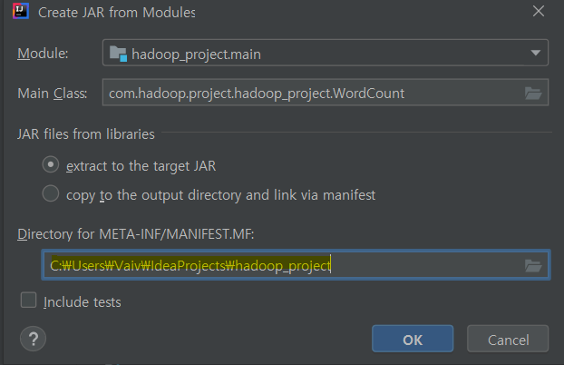

# 하둡 클러스터에 MapReduce 프로젝트를 배포해보자👍

## Apache Clone Word Count

- [소스코드](https://github.com/kwonsye/VAIVCompanyEducationProject/blob/master/hadoop_project/src/main/java/com/hadoop/project/hadoop_project/WordCountForDeploy.java)

- IntelliJ 에서 Jar 파일 만들기
    - https://www.hyoyoung.net/100
    - 이렇게 했는데 계속 main을 못찾는다고 에러가 났는데,
    - **META-INF 폴더는 root 폴더 바로 아래에 만들어야한다.**
    - Jar를 만들때 위치 설정을 이렇게 해주어야한다.  
    
        

    - 하여튼 이렇게 만들고 build 하면 `{project root}/out/artifacts/{jar file directory}` 하위에 jar 파일이 생긴다.  

- scp 로 서버에 jar 파일 전송
    - *로컬*
        - `scp {로컬의 jar file path} {서버 username}@{서버 ip}:{전송시키고 싶은 서버 로컬 path}`
        - Ex) `scp hadoop_project.main.jar trendmap@{tm2 서버 ip}:/home/trendmap`
    
-  word count 테스트용 input 파일을 **하둡 클러스터의 hdfs에 올려놓자**  
    - scp 로 서버에 input 파일 전송
        - *로컬* 
            - `scp /wordcount_data/input/* trendmap@{tm2 서버 ip}:/home/trendmap`
    - hdfs 에 input 디렉토리 생성
        - *tm 서버*
            - `hdfs dfs -mkdir /user/trendmap/input`
    - **서버의 로컬에서 hdfs로 파일 전송**
        - *tm 서버*
            - `hdfs dfs -put /home/trendmap/{input file name} /user/trendmap/input`  

- 준비끝! 이제 하둡에서 Jar 파일을 실행시켜보자
    - *tm 서버*
        - `hadoop jar {jar 파일 path} {hdfs input data directory path} {hdfs output data directory path}`
        - Ex) `hadoop jar hadoop_project.main.jar /user/trendmap/input /user/trendmap/output`

- MapReduce 완료 후 output 확인
    - *tm 서버*
        - `hdfs dfs -text {hdfs ouput file path}`
        - Ex) `hdfs dfs -text /user/trendmap/output/*`  

        ```
        Goodbye 1
        Hello   2
        World   2
        Hadoop  1
        to      1
        Bye     1
        hadoop  1
        ```  

<br>

## Twitter Contents Word Count

- [소스코드](https://github.com/kwonsye/VAIVCompanyEducationProject/blob/master/hadoop_project/src/main/java/com/hadoop/project/hadoop_project/twitter_project/TwitterWordCount.java)
- hdfs 에 올려져있는 Twitter json 형식
```json
{
   "channelId":2,
   "documentUnitId":101001,
   "documentId":"1079754045802217473",
   "content":"@1theleft 금손님!  새해 건강하시고 소망하는 모든일 다 이루시길..  \n새해 복 많이 받으세요~!!",
   "documentDateTime":"20190101000000",
   "registerDateTime":"20190101005959",
   "updateDateTime":"20190101005959",
   "languageCode":"KO",
   "deleteYn":"N",
   "commentCount":0,
   "shareCount":0,
   "authorId":226882770,
   "displayAuthorId":"58jjang",
   "authorName":"9회말 2아웃",
   "replyId":"1079750284300242945",
   "replyAuthorId":204386721,
   "isSharing":"N",
   "sharedId":null,
   "sharedAuthorId":null,
   "entities":{
      "hashtags":[
         
      ],
      "urls":[
         
      ],
      "user_mentions":[
         {
            "screen_name":"1theleft",
            "name":"더레프트",
            "id":204386721,
            "id_str":"204386721",
            "indices":[
               0,
               9
            ]
         }
      ],
      "symbols":[
         
      ]
   }
}
```

- TIP🎯
    - json pretty하게 보기 fea jq
        - `hdfs dfs -text [src_file] | jq '.'`
    - 파일 앞에 5줄만 끊어 보기
        - `hdfs dfs -text [src_file] | head -n 5 | jq '.'`

- Json의 쉬운 파싱을 위해 `jackson-core`와 `lombok` 사용  

    - `build.gradle`에 dependency 추가  

    ```gradle
    compile group: 'com.fasterxml.jackson.core', name: 'jackson-databind', version: '2.11.2'

    compile "org.projectlombok:lombok:1.18.8"
    annotationProcessor("org.projectlombok:lombok:1.18.8")
    ```  

    - [jackon-core + lombok 을 이용한 json 파싱](https://sg-choi.tistory.com/188)
    - [IntelliJ 롬복 플러그인 설치 + Annotation Processing 설정](https://imasoftwareengineer.tistory.com/31)  


- jar 실행
    - 2019-01-01 하루치_1분 걸렸음
        - `hadoop jar hadoop_project.main.jar /user/trendmap/data/twitter/2019/01/20190101/new_??????????.txt.gz /user/trendmap/twitter_output/20190101`

    - 2019-01 한달치_5분 걸렸음
        - `hadoop jar hadoop_project.main.jar /user/trendmap/data/twitter/2019/01/201901??/new_??????????.txt.gz /user/trendmap/twitter_output/201901`

    - 2019 일년치_1시간 걸렸음
        - `hadoop jar hadoop_project.main.jar /user/trendmap/data/twitter/2019/??/2019????/new_??????????.txt.gz /user/trendmap/twitter_output/2019`    

<br>

## 로그/Counter 보는 습관을 들이자!🤔  

- 클러스터의 Yarn ResourceManager Web UI
- 실행한 Application 확인
- MapReduce Job 확인
    - Job Counters 확인
    - **Map Tasks** for Job 확인
        - task 각각 시간이 얼마나 걸렸는지
        - Task 개별 Attempts 확인
            - Task Counters 확인
                - Map task 가 HDFS에서 읽어온 파일 크기가 얼마인지
            - Attemps logs 확인 + full log

    - **Reduce Tasks** for Job 확인
        - task 각각 시간이 얼마나 걸렸는지
        - Task 개별 Attempts 확인
            - Task Counters 확인
                -  Reduce task 가 HDFS에 쓴 파일 크기가 얼마인지
            - Attemps logs 확인 + full log

- **mapper의 개수는 input 파일의 개수와 동일**
- **각각의 reducer 에서는 알아서 소팅된 결과를 쓴다.** 따라서 맵퍼에서 리듀서한테 잘 전달해주는 작업만 하면 된다.

<br>

## Reference

- [[Java] JSON 파싱](https://sg-choi.tistory.com/188)
- [jar 파일 생성 시 MANIFEST.MF 작성](https://digicom.tistory.com/383)
- [hadoop (하둡) 이클립스에서 생성한 jar 파일 실행하기](https://bigmark.tistory.com/33)
- [인텔리제이 한글 인코딩 문제 해결방법](https://beemiel.tistory.com/4)