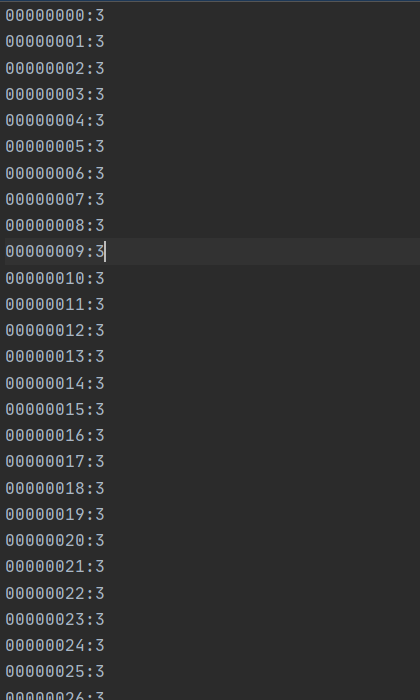

# Word Count

### 소스코드
- https://github.com/kwonsye/VAIVCompanyEducationProject/blob/master/JavaProject/src/WordCount.java

<br>

### Rule
- 한 줄에 하나의 단어가 존재하는 수천만줄의 데이터가 주어진다. 
- 단어는 중복될 수 있다.
- 단어는 정렬이 되어 있는 상태가 아니다.
- 이 파일에 어떤 단어가 몇 번씩 나왔는지 계산해서 `{단어}:{단어가 나온 횟수}` 로 다른 파일에 출력해야한다.  
  
<br>

### 첫 접근
- 단순하게 HashMap<String, Integer> 을 이용해서 전체 파일을 한 줄씩 읽으면서 `Key : 단어 - Value : 단어가 나온 횟수` 를 저장하면 되지 않을까..

<br>

```java
...

/*단순하게 모든 줄의 데이터를 읽어서 HashMap에 모두 넣은 후 사전 순으로 정렬하는 메소드*/
private static void wordCountForOutOfMemory(String dataFile) throws IOException {
        BufferedReader bufferedReader = new BufferedReader(new FileReader(dataFile));
        Map<String, Integer> map = new HashMap<>(); //Key : 단어 - Value : 단어가 나온 횟수
        String data;
        long lineCount = 1;

        while ((data = bufferedReader.readLine()) != null) {
            map.put(data, map.getOrDefault(data, 0) + 1); //파일을 한 줄씩 읽어서 횟수와 함께 HashMap에 저장한다.
           
            if (lineCount % PRINT_INTERVAL == 0) {
                showMemoryStatus(); //메모리 상태를 보여준다.
            }
            lineCount++;
        }

        String[] sortedKeys = sortingKeySet(map.keySet()); //단어들을 사전 순으로 정렬한다.
        
        //사전 순으로 정렬된 map data를 {단어}:{나온 횟수} 형식으로 파일에 write
        writeMapDataToFile(OUT_OF_MEMORY_FILE_PREFIX + FILE_EXTENSION, map, sortedKeys);

        bufferedReader.close();
    }
```

<br>

### 실행한 결과

- **IntelliJ 에서 JVM 힙사이즈 변경하는 방법**
    - [Run > Edit Configurations]
    - `-Xmx512m` 로 제한을 둔다.

    

- **JVM heap space Out of memory** 가 터짐

    

    - 큰 데이터를 들고 있기에 메모리가 부족하기 때문에 out of memory 발생!!

<br>

### 그럼 어떻게 메모리를 적게 쓰면서 문제를 해결할 수 있을까?

- **분할 정복의 방법**을 써보자!
- 메모리때문에 Map에서 그 많은 데이터를 통째로 담고 있기가 어렵다면,
    - 데이터를 작은 단위(`FLUSH_UNIT_OF_MAP_SIZE`)로 나누어서 그 개수 만큼만 Map 에 저장해보자!
    - while()
        - 작은 단위로 나누어서 Map 에 저장하고 
        - Map을 정렬 후
        - 파일에 쓴다
        - Map.clear()
        - 단위 파일들을 `merge` 하며 진행

- 1--->7의 방향으로 이동


<br>

```java
...
private static void wordCountSolution(String dataFile) throws IOException {
        BufferedReader bufferedReader = new BufferedReader(new FileReader(dataFile));
        Map<String, Integer> map = new HashMap<>();
        String word;
        int unitFileCount = 1;

        while ((word = bufferedReader.readLine()) != null) {
            map.put(word, map.getOrDefault(word, 0) + 1);

            //divide
            if (map.size() == FLUSH_UNIT_OF_MAP_SIZE) {
                String[] sortedKeys = sortingKeySet(map.keySet());
                writeMapDataToFile(UNIT_FILE_PREFIX + unitFileCount + FILE_EXTENSION, map, sortedKeys);
                map.clear(); //핵심!!

                if (unitFileCount % 2 == 0) {
                    merge(unitFileCount - 1, unitFileCount); //파라미터로 넘긴 idx 에 해당하는 두 개의 파일을 비교해서 하나의 파일로 합친다.
                    unitFileCount++;
                }
                unitFileCount++;
            }

        }

        //map 의 남은 데이터들을 파일에 쓴다.
        if (!map.isEmpty()) {
            String[] sortedKeys = sortingKeySet(map.keySet());
            writeMapDataToFile(UNIT_FILE_PREFIX + unitFileCount + FILE_EXTENSION, map, sortedKeys);
            merge(unitFileCount - 1, unitFileCount);
        }

        bufferedReader.close();
}
```
<br>

### 실행 결과

- out of memory 문제 발생하지 않고 프로젝트 성공적으로 종료
- 실행시간이 느린 이유는 **여유 메모리가 적다면 GC가 가비지 컬렉팅을 진행해서 메모리공간을 확보하기 때문이다!**

<br>


<br>

- 최종 output file의 일부



<br>

### 피드백

- write하는 파일 format에 대한 클래스 혹은 메소드 만들어서 분리해보기 == merge() 메소드 안에서 formatting + parsing 작업 + 파일을 write하는 로직과 문자를 비교해서 merge하는 로직을 분리해보자!
- merge() 메소드를 조금 더 일반화하기 위해서 파라미터에 파일의 index 를 받는 것보다 Reader 객체를 받아보자
- wirte 되는 파일들에 대해서 단계별로 디렉토리를 만들어서 디렉토리 안에 파일들을 저장해보기

<br>

### 배운 것

- intellij에서 jvm힙사이즈 설정하는 방법
- Error와 Exception의 차이
    - **Exception**
        - 실행 도중 중단될 정도로 큰 문제가 아닐 때 발생하는 것
        - try-catch, throw 로 예외처리가 가능
        - Checked Exception
            - 컴파일단 익셉션
            - FileNotFoundException
        - Unchecked Exception
            - 런타임단 익셉션
            - NullPointerException
    - **Error**
        - 런타임에서 실행 시 발생되며 전부 예측 불가능한 Unchecked Error
        - 코드를 고치지 않고서는 해결이 불가능
        - OutOfMemoryError
        
- intellij에서 클래스의 Type Hierarchy 보는 방법 : `Ctrl + H`
- `try-with-resources`