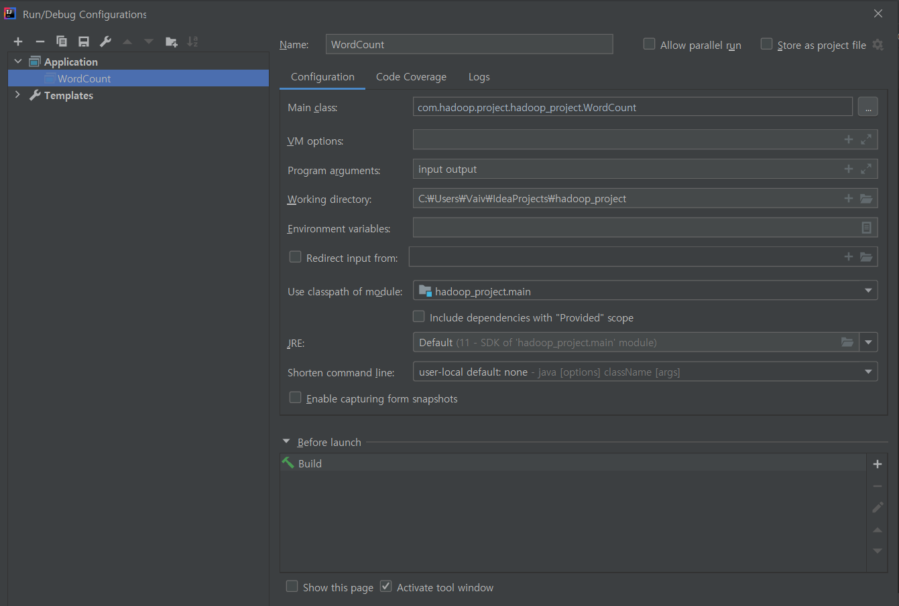

# Apache MapReduce Tutorial 클론코딩 해보기

- [깃허브 소스 코드](https://github.com/kwonsye/VAIVCompanyEducationProject/blob/master/hadoop_project/src/main/java/com/hadoop/project/hadoop_project/WordCount.java)

- 아파치에 올라와 있는 맵리듀스 튜토리얼
    - https://hadoop.apache.org/docs/current/hadoop-mapreduce-client/hadoop-mapreduce-client-core/MapReduceTutorial.html

- 정석적인 방법이라면 로컬에서 코딩 후 **빌드한 jar 파일을 hadoop cluster에 올려 배포**해야한다.

- 하지만 이 부분은 **로컬에서 잘 돌아가는지 테스트** 해본 후, 기회가 된다면 회사 테스트용 하둡 클러스터에 배포해보기로 하자..

<br>

## Window10 로컬에서 하둡 테스트 환경 설정하기

- IDE : `IntelliJ`
- Build Tool : `Gradle 6.3`
- Java version : `11.0.8 2020-07-14 LTS`

1. IDE에서 Gradle 기반 Java 프로젝트를 생성한다.
2. `build.gradle` 파일에 **dependency**를 추가한다.
    - `hadoop-client 2.7.3`
    - `maven-jar-plugin 3.0.2`
    - `build.gradle` 예시
    ```gradle
    plugins {
        id 'java'
    }

    group 'com.hadoop.project'
    version '1.0-SNAPSHOT'

    repositories {
        mavenCentral()
    }

    dependencies {
        testCompile group: 'junit', name: 'junit', version: '4.12'
        implementation group: 'org.apache.hadoop', name: 'hadoop-client', version: '2.7.3'
        implementation group: 'org.apache.maven.plugins', name: 'maven-jar-plugin', version: '3.0.2'
    }   
    ```

3. `WordCount.java` 생성 후 복붙 및 import
    - [Apache WordCount1 예제 소스코드](https://hadoop.apache.org/docs/current/hadoop-mapreduce-client/hadoop-mapreduce-client-core/MapReduceTutorial.html#Example:_WordCount_v1.0)

4. 소스코드의 main을 보면 **input 과 output 디렉토리 path를 실행할 때 args로 넘겨준다.**

    ```java
    FileInputFormat.addInputPath(job, new Path(args[0]));
    FileOutputFormat.setOutputPath(job, new Path(args[1]));
    ```
    
    4-1. 따라서 **input 데이터 file을 넣어둘 `/input` 디렉토리**를 프로젝트 하위에 만들어주고  

    4-2. WordCount할 테스트 **input file**들을 만들어서 넣어준다.  
        
    - `/input/file1.txt`

    ```
    Hello World Bye World
    ```

    - `/input/file2.txt` 

    ```
    Hello Hadoop Goodbye Hadoop
    ```  

5. 끝인줄 알고 main을 돌려봤는데...

    `java.io.IOException: (null) entry in command string: null chmod 700`

    이 에러가 계속 났다😂😂

6. 구글링 해보니 **`HADOOP_HOME` 환경 변수**도 세팅이 안되어 있고, **`hadoop.dll` 와 `winutil.exe`** 가 없어서 발생한 문제였다.  

    - `dll` 파일은?
        - **동적 링크**라고 하며 **실행 파일**에서 해당 라이브러리의 기능을 **사용 시에만, 라이브러리 파일을 참조**하여(혹은 다운로드받아) 기능을 호출
    - `winutil.exe` 가 뭐지?
        > it is for **running shell commands on Windows OS**. You can find it in org.apache.hadoop.util.Shell, other modules depends on this class and uses it's methods  

    6-1. 로컬에 `C:\winutil\bin` 디렉토리 생성      

    6-2. https://github.com/steveloughran/winutils/tree/master/hadoop-2.8.1 에서 `winutil-hadoop2.8.1` 다운로드    

    - [깃허브 링크를 paste 하면 쉽게 압축해서 다운받을 수 있는 사이트](https://minhaskamal.github.io/DownGit/#/home)  

    6-3. `winutil-hadoop2.8.1`의 압축을 풀어서 내부 파일들을 `C:\winutil\bin` 하위로 이동시킨다.  

    6-4. 이제 `HADOOP_HOME` 환경변수를 설정해주면 된다.  

    - [환경변수 설정] 에서 **사용자 변수에 HADOOP_HOME = C:\winutil** 추가

    - 여기까지만 하고 돌려서 `java.lang.UnsatisfiedLinkError: org.apache.hadoop.io.nativeio.NativeIO$Windows.access0(Ljava/lang/String;I)Z` 때문에 어이없이 엄청 헤맸다...😓  
        - [reference](https://stackoverflow.com/questions/41851066/exception-in-thread-main-java-lang-unsatisfiedlinkerror-org-apache-hadoop-io)
        

    - **사용자 변수 Path 항목에 %HADOOP_HOME%\bin 추가**

    - [reference](https://stackoverflow.com/questions/48314451/apache-nutch-error-injector-java-io-ioexception-null-entry-in-command-strin)

7. 런타임 시 **args 설정**해주기
    - `[IntelliJ > Run > Edit Configurations]`
    

8. 이제 드디어 Run 하면 에러 없이 잘 돌아가고 **args 로 줬던 output path `/output` 디렉토리**에 맵리듀스 작업의 결과 파일이 잘 들어가있다!!!

    ```
    Bye	1
    Goodbye	1
    Hadoop	2
    Hello	2
    World	2
    ```

<br>

## Reference

- https://jongmin92.github.io/2016/12/13/Linux%20&%20Ubuntu/ls-result-color-change/
- https://jyoondev.tistory.com/46?category=82426
- https://goddaehee.tistory.com/185
- https://stackoverrun.com/ko/q/10538080
- https://stackoverflow.com/questions/48314451/apache-nutch-error-injector-java-io-ioexception-null-entry-in-command-strin
- https://stackoverflow.com/questions/41851066/exception-in-thread-main-java-lang-unsatisfiedlinkerror-org-apache-hadoop-io
- https://stackoverflow.com/questions/40764807/null-entry-in-command-string-exception-in-saveastextfile-on-pyspark