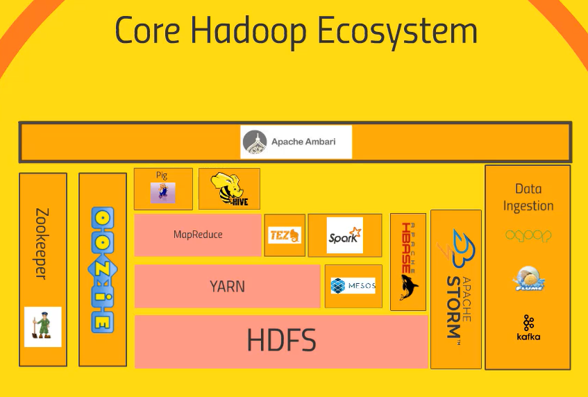

# [Section 1] Hadoop에 대한 소개와 Hortonworks Sandbox 설치

## 하둡🐘

- 컴퓨터 클러스터에서 **방대한 양의 데이터 세트를 변환하고 분석**하기위한 강력한 도구
- 수백개의 기술들이 모여있는 생태계 -> **서로 어떤 관계와 역할들이 fit 되어 있는지** 아는게 중요!
- 각각의 기술은 관계형/비관계형 DB에서 데이터를 가져와서 쿼리로 분석함

<br>

## 하둡 Eco system 을 본격적으로 공부하기 전 준비운동하기🤸‍♂️

- <del>[Virtualbox](https://www.virtualbox.org/wiki/Downloads) 가상머신 </del>
- <del>[Hortonworks HDP Sandbox 2.6.5 설치](https://www.cloudera.com/downloads/hortonworks-sandbox/hdp.html)</del>
    - sandbox란?
        - 외부 프로그램이나 파일을 보호된 영역인 **가상화 내부에서 실행**시킴으로써 내부 시스템에 악영향을 주는 것을 방지하는 기술
        
    - Hortonworks나 Cloudera 같은 빅데이터 유명 벤더사들은 자사의 **하둡 환경에 대한 패키지를 가상환경에 올려놓고  테스트** 할 수 있도록 만들어놓음.
        
- => **회사의 테스트용 서버(Linux)에 ssh로 접속해서 진행하기로!**

- [Grouplens > older datasets](https://grouplens.org/datasets/movielens/) 에서 데이터set을 다운로드 받을 수 있음

    - `wget http://files.grouplens.org/datasets/movielens/ml-100k.zip`

    - `unzip ml-100k`

- Ambari
        
    - **웹 UI를 제공해서 Hadoop eco 설치, 설정배포, 모니터링, Alert 등의 운영 편의성**을 제공하고  Hadoop 클러스터의 관리를 쉽게 하게 해주는 툴

    - Ambari로 기존에 구축되어있는 하둡 클러스터를 관리할 수는 없다.

    - 강의 예제에서는 Ambari를 통해 웹UI로 테스트 데이터셋을 `hive` 에 insert 하지만, 나는 이미 구축된 하둡 클러스터에서 진행해야하기 때문에 직접 `hive cli`에서 데이터셋을 insert 해야했다.

- `hive cli` 에서 `hiveQL`을 이용해 데이터셋 insert 하기
        
    1. `hive` 명령어로 hive cli 접속
    2. insert할 데이터셋 스키마에 맞는 hive table을 만든다.
            
        - insert할 `ml-100k/u.data` 데이터셋 형태
        ```
        //순서대로 user id, movie id, 별점, 별점을 남긴 timestamp

        196	242	3	881250949
        186	302	3	891717742
        ...
        ...
        ```

        - 테이블 만들기
            
        ```sql
        CREATE TABLE ratings (user_id int, movie_id int, raing int, rating_time int)
        ROW FORMAT DELIMITED FIELDS TERMINATED BY '\t' -- 데이터셋이 한 row안에서 tab으로 구분되어 있음
        LINES TERMINATED BY '\n'; --데이터셋의 라인은 개행으로 구분되어 있음
        ```
        
    3. 생성한 `ratings` 테이블에 데이터셋 파일 insert 하기
        
    ```sql
    LOAD DATA LOCAL INPATH '/home/trendmap/ml-100k/u.data' -- path에 있는 파일을 로드한다.
    OVERWRITE INTO TABLE ratings;
    ```

<br>


## 하둡 Eco system 톺아보기🐘

<br>


- 하둡이란?

    - 컴퓨터 클러스터 상에서 돌아가는 매우 큰 데이터셋에 대한 **분산 처리와 분산 스토리지를 위한 오픈 소스 소프트웨어 플랫폼**

    - 컴퓨터 클러스터? 💻
        - 여러 대의 컴퓨터들이 연결되어 하나의 시스템처럼 동작하는 컴퓨터들의 집합
    
    - 즉, 하둡은 **여러 대의 컴퓨터 power를 사용해서 분산 storage의 빅데이터를 병렬로 Divide and Conquer하여 처리**하는 수단을 제공한다!

- 하둡의 역사
    - **구글**이 하둡 기원의 어무니
    - 구글은 자사의 검색엔진이 사용하는 분산파일시스템과 MapReduce 기법을 논문으로 발표했는데, 이게 하둡의 idea가 되었다.
    - 2006년부터 Yahoo 더그커팅에 의해서 하둡이 개발되었다.
    - 더그커팅의 자녀가 가지고 있던 노란색 코끼리 인형의 이름이 하둡이었다는 소문🤔 

- 왜 하둡을 쓸까?
    - 데이터가 무지하게 많아지고 커짐
    - 컴퓨터 클러스터의 많은 cpu를 쓰기 때문에 병렬로 빠른 처리가 가능함
    - 컴퓨터의 수평적인 확장을 통해서 더 많은 데이터와 빠른 처리가 가능함
    - 하둡 상에서 적절하게 interactive한 쿼리를 통해서 빅데이터를 빨리 처리하고 분석할 수 있음

- Core 하둡 Ecosystem

    
    - 핑크색 : 하둡을 구성하는 core 부분
    - 나머지는 하둡의 세부적인 문제를 해결하기 위해서 나중에 계속 추가되어진 어플리케이션들
    - **HDFS**
        - Hadoop Distributed File System
        - 컴퓨터 클러스터에 **빅데이터를 분산 저장**하고, 저장된 데이터를 빠르게 처리할 수 있게 하는 파일시스템
        - 파일을 특정크기의 **블록**으로 나누어 **분산된 서버에 저장**
        - 여러 노드에 **데이터를 복제**해서 back up 해놓기 때문에, 장애로 데이터 분실시 데이터 유실을 방지함
    
    - **Yarn**
        - Yet Another Resource Nagotiator
        - 하둡 2.0부터 제공되는 컴퓨터 클러스터의 리소스 관리 플랫폼
        - 각 어플리케이션에 필요한 리소스(CPU, 메모리, 디스크 등)를 할당하고 모니터링
        - MapReduce의 단점을 보완하기 위해서 등장

    - **MapReduce**
        - 빅데이터를 처리를 위한 병렬 처리 분산 프로그래밍 모델
        - 데이터를 여러 노드에 병렬로 분산해서 처리
        - 클러스터에 있는 노드들을 주기적으로 모니터링해서, 응답이 없을 경우 해당 노드를 클러스터에서 제외하고 데이터를 복원해서, 작업을 계속 처리할 수 있도록 관리
        - mappers + reducers
        - mappers
            - data transform
            - 흩어져 있는 데이터를 관련 있는 데이터끼리 묶음
        - reducers
            - data aggregate
            - 


<br>

## Reference
- https://brownbears.tistory.com/78
- https://datacookbook.kr/55
- https://datacookbook.kr/32
- https://bigmark.tistory.com/39
- https://byline.network/2016/01/1-47/
- https://stackoverflow.com/questions/50101717/hive-insert-permission-denied-user-root-access-write
- https://yookeun.github.io/java/2015/05/24/hadoop-hdfs/
- https://opentutorials.org/module/2926/17248
- https://over153cm.tistory.com/entry/%EB%A7%B5%EB%A6%AC%EB%93%80%EC%8A%A4MapReduce%EB%9E%80-1