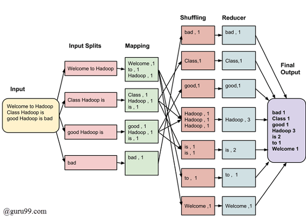

# [Section 1-2] 하둡 Eco system 톺아보기🐘

 

## 하둡이란?

- 컴퓨터 클러스터 상에서 돌아가는 매우 큰 데이터셋에 대한 **분산 처리와 분산 스토리지를 위한 오픈 소스 소프트웨어 플랫폼**

- 컴퓨터 클러스터? 💻
    - 여러 대의 컴퓨터들이 연결되어 하나의 시스템처럼 동작하는 컴퓨터들의 집합
    
- 즉, 하둡은 **여러 대의 컴퓨터 power를 사용해서 분산 storage의 빅데이터를 병렬로 Divide and Conquer하여 처리**하는 수단을 제공한다!

 

## 하둡의 역사

- **구글**이 하둡 기원의 어무니
- 구글은 자사의 검색엔진이 사용하는 분산파일시스템과 MapReduce 기법을 논문으로 발표했는데, 이게 하둡의 idea가 되었다.
- 2006년부터 Yahoo 더그커팅에 의해서 하둡이 개발되었다.
- 더그커팅의 자녀가 가지고 있던 노란색 코끼리 인형의 이름이 하둡이었다는 소문🤔 

 

## 왜 하둡을 쓸까?

- 데이터가 무지하게 많아지고 커짐
- 컴퓨터 클러스터의 많은 cpu를 쓰기 때문에 병렬로 빠른 처리가 가능함
- 컴퓨터의 수평적인 확장을 통해서 더 많은 데이터와 빠른 처리가 가능함
- 하둡 상에서 적절하게 interactive한 쿼리를 통해서 빅데이터를 빨리 처리하고 분석할 수 있음

## Core 하둡 Ecosystem

 

 

- 핑크색 -> 하둡을 구성하는 core 부분
- 나머지는 하둡의 세부적인 문제를 해결하기 위해서 나중에 계속 추가되어진 어플리케이션들

- **HDFS**
    - Hadoop Distributed File System
    - 컴퓨터 클러스터에 **빅데이터를 분산 저장**하고, 저장된 데이터를 빠르게 처리할 수 있게 하는 파일시스템
    - 파일을 특정크기의 **블록**으로 나누어 **분산된 서버에 저장**
    - 여러 노드에 **데이터를 복제**해서 back up 해놓기 때문에, 장애로 데이터 분실시 데이터 유실을 방지함
    
- **Yarn** or Mesos
    
    - Yet Another Resource Nagotiator
    - 하둡 2.0부터 제공되는 컴퓨터 클러스터의 **리소스 관리** 플랫폼
    - 각 어플리케이션에 **필요한 리소스(CPU, 메모리, 디스크 등)를 할당**하고 모니터링
    - MapReduce의 단점을 보완하기 위해서 등장

- **MapReduce**
    
    - 빅데이터를 처리를 위한 **병렬 처리 분산 프로그래밍 모델**
    -  여러 노드에 태스크를 분배하는 방법으로 데이터를 **여러 노드에 병렬로 분산**해서 처리
    - MapReduce 작업이 끝나면 **HDFS에 파일이 써지고**, MapReduce 작업이 시작할때는 **HDFS로 부터 파일을 가져오는** 작업이 수행됨 ->  작업 중간 임시 데이터도 디스크에 쓰게 되어 **IO 작업으로 인한 오버헤드**가 많은 단점

    - 분산 환경에서 **대용량의 데이터를 배치(Batch) 형태로 처리**되도록 설계가 되어서, **속도가 느린** 단점

    - 수행 결과는 머신의 오류를 고려하여 데이터를 복제, 분산하여 안전하게 저장
        
    - **mappers + reducers**
        
    
        
    - mappers
        - **data transform**
        - 흩어져 있는 데이터를 관련 있는 데이터끼리 **묶어서** intermediate **key-value 쌍**으로 만듦
            
    - reducers
        - **data aggregate**
        - 맵 작업으로부터 생성된 key-value 쌍에 대해 중복 데이터를 제거한 후 원하는 **데이터를 추출**하는 작업

        
- Pig🐖
    - 비직관적이고 반복적인 코딩을 줄이면서 MapReduce를 사용할 수 있는 조금 더 **고차원의 스크립트 언어와 이를 위한 인프라**로 구성됨
        
- **Hive**🐝
    - **SQL을 이용하여 맵리듀스를 실행**할 수 있게 해주는 쿼리 엔진
    - RDB의 데이터베이스, 테이블과 같은 형태로 HDFS에 저장된 데이터의 구조를 정의하는 방법을 제공
    - 이 데이터를 대상으로 **SQL과 유사한 HiveQL 쿼리를 이용하여 데이터를 조회하는 방법을 제공**

- Impala🦌

    - 하둡상에서 **HBase나 MapReduce를 거치지 않고 별도의 실행엔진을 통해 HDFS와 직접 통신하면서 SQL을 아주 낮은 지연속도로 처리**
    - **SQL 온 하둡**(SQL on Hadoop)
    - Hive, Pig는 맵-리듀스 언어로 변환되어 처리되기 때문에 SQL 실행 시간이 많이 소요된다는 단점을 임팔라가 보완
    - C++ 기반
    - 임팔라와 하이브의 최대 차이는 성능

        
- Ambari or Hue
    - Cloudera Hue(Hadoop User Experience)는 Apache Hadoop 클러스터와 함께 사용되는 웹 기반 사용자 인터페이스

- **Spark**✨
    - 오픈소스 **분산 쿼리 및 처리 엔진**
    - 기본적으로 똑같은 맵리듀스 개념을 사용하지만, 스파크만의 데이터 처리방법과 태스크 정리 방법으로  **유연성과 맵리듀스에 대한 확장성을 훨씬 빠른 속도로** 제공함.
    - 데이터가 메모리에 저장돼 있을 때는 아파치 하둡보다 100배 빠르며, 디스크에 저장돼 있을 때는 10배 빠름

- Tez
    - YARN 기반의 비동기 사이클 그래프 프레임워크
    - Hive 에서 맵리듀스 대신 실행엔진으로 사용할 수 있다. 
    - **맵단계 처리 결과를 메모리에 저장**하고, 이를 리듀스 단계로 바로 전달 -> IO 오버헤드를 줄여서 속도를 높일수 있다.

- **HBase**🐋
    - **HDFS 위에 만들어진 데이터 분산 컬럼 기반의 비관계형 데이터베이스(NoSQL)**
    - HDFS의 대규모 데이터셋에 대한 **실시간 random access**읽기/쓰기 기능 제공
    - 스키마 지정 및 변경 없이 데이터를 저장할 수 있으며 HDFS에서 동작하기 때문에 가용성 및 확장성을 그대로 이용할 수 있다.

- Apache Storm
    - 분산형 **스트림 프로세싱** 연산 프레임워크
    - 실시간으로 대용량 데이터를 분산 처리하는 시스템

- **Oozie**
    - 하둡의 **잡(job)을 관리하기 위한  Workflow 스케쥴러**(혹은 orchestration) 프레임워크

- Zookeeper🧔
    - 하둡의 분산 환경에서 **노드들간의 상호 조정이 필요한** 정보 공유, 락, 이벤트 등의 서비스를 제공
    - **partial failure를 안전하게 다루면서** 분산 응용 프로그램을 구출할 수 있도록 도와주는 도구 제공
    -  네임노드를 감시하여 시스템을 감시 -> 네임노드가 죽었을시, 그 다음 네임노드 후보를 선출

- **Sqoop**🥄
    - 관계형 데이터베이스와 하둡 사이에서 **데이터 이관을 지원**하는 툴
    - 관계형 데이터베이스의 데이터를 HDFS, Hive, Hbase에 임포트(import)하거나, 반대로 관계형 DB로 익스포트(export)할 수 있다. 

- **Kafka**
    - 실시간으로 기록 스트림을 게시, 구독, 저장 및 처리할 수 있는 **분산 메세징 데이터 스트리밍 플랫폼**
    - **대용량의 실시간 로그처리**에 특화되어 있는 솔루션이며 **데이터를 유실없이 안전하게 전달하는 것이 주목적인 메세지 시스템**에서 Fault-Tolerant한 안정적인 아키텍처와 빠른 퍼포먼스로 데이터를 처리할 수 있다.
    - publish-subscribe 모델을 기반으로 동작한다.

- External DB
    - Sqoop으로 클러스터의 data를 떠서 external DB들에 저장할 수 있다. 
    - MySQL, Cassandra, **MongoDB**...

 

## Reference

- https://yookeun.github.io/java/2015/05/24/hadoop-hdfs/
- https://opentutorials.org/module/2926/17248
- https://over153cm.tistory.com/entry/%EB%A7%B5%EB%A6%AC%EB%93%80%EC%8A%A4MapReduce%EB%9E%80-1
- https://sarc.io/index.php/nosql/167-nosql-mapreduce
- https://moons08.github.io/programming/pig/
- https://wikidocs.net/23282
- https://12bme.tistory.com/305
- https://wikidocs.net/23569
- https://dydwnsekd.tistory.com/4
- https://epicdevs.com/17
- https://ryufree.tistory.com/220