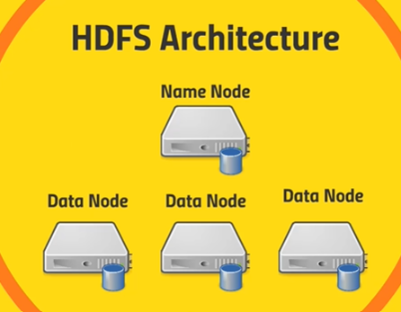

# [Section 2] HDFS를 이해해보자

## HDFS

- Hadoop Distributed File System
- 전체 클러스터에 **작은 블럭들(128 megabytes)로 쪼개져서 분산**되어 있는 빅데이터를 최적화해서 다루기 위해 만들어졌다.
- 컴퓨터가 죽어서 데이터 유실을 방지하기 위해 블럭들은 **여러 컴퓨터에 복사되서 저장**된다.
-  빅데이터를 분산 방식으로 전체 클러스터에 저장할 수 있게 한다.
- 애플리케이션이 저장된 데이터를 분석하여 **해당 데이터에 빠르게 액세스** 할 수 있도록 한다.

## HDFS 아키텍쳐

- **마스터-워커**(master-worker) 패턴으로 동작하는 두 종류의 노드(마스터인 하나의 **네임노드**(namenode)와 워커인 여러 개의 **데이터노드**(datanode)로 구성

- **Name Node**
    - 파일시스템의 네임 스페이스를 관리하는 **마스터 역할**을 하며, 슬레이브에 해당하는 **데이터 노드에게 입출력에 관련된 작업을 지시**
    - 파일이 어떤 형태의 블록 단위로 나누어져 있는지, 시스템 전반에 대한 상태 등을 모니터링한다.
    - 파일에 속한 모든 블록이 어느 데이터노드에 있는지 파악하고 있다.

- **Data Node**
    - 클라이언트나 네임노드의 요청이 있을 때 **실질적으로 블록을 저장하고 탐색**하며, 저장하고 있는 블록의 목록을 주기적으로 네임노드에 보고한다.

## HDFS's Flow : Reading a file

1. client🙋‍♀️ "나 이 정보 가져오고 싶어. 어디서 찾아야해?"
-> to NameNode 

2. NameNode👩‍✈️ "그 정보에 대한 블럭은 1번,3번 데이터 노드에 있어." -> to client

3. client🙋‍♀️는 해당 데이터 노드에서 원하는 데이터가 있는 블럭을 가져온다.

## HDFS's Flow : Writing a file

1. client🙋‍♀️ "파일 하나 저장하고 싶어" -> to NameNode

2. NameNode👩‍✈️ "OK" -> to client

3. client🙋‍♀️는 파일을 써서 데이터노드에게 전달

4. 데이터 노드끼리 블럭을 복제해서 저장

5. DataNode👩‍🔧 "데이터 성공적으로 저장 완료했어" -> to client

6. client🙋‍♀️ "몇번 데이터노드에 성공적으로 저장했대" -> to NameNode

7. NameNode👩‍✈️ "OK 몇번 데이터노드들에 블럭이 저장됐는지 기록해놓을게"

 

## 네임노드 장애복구를 위한 메커니즘

- 네임노드 로컬 디스크와 원격의 NFS 에 meta data를 백업한다.
- 주기적으로 네임스페이스 이미지를 edit log 와 병합하여 새로운 네임스페이스 이미지를 만드는 보조 네임노드(Secondary namenode)를 운영한다.
- **Hadoop의 HA**
    - High Availability 고가용성
    - 활성대비(active-standby)상태로 설정된 한 쌍의 네임노드로 구현 가능
    - **활성 네임노드(active namenode)에 장애가 발생하면 대기 네임노드(standby namenode)가 그 역할을 이어받아** 큰 중단 없이 클라이언트 요청을 처리
    - Zookeeper 등이 누가 active namenode인지 tracking한다.

 

## HDFS 클라이언트
- UI 툴
- CLI
- Http / HDFS 프록시 서버
- 자바 인터페이스
- NFS 게이트웨이

 

## CLI 로 HDFS에서 작업해보기

 

### HDFS에 data set을 넣어보자

- `ssh` 로 회사 공부용 하둡 서버에 접속
- `hdoop fs -ls` 로 HDFS의 파일시스템을 볼 수 있다.
-  `hadoop fs -mkdir ml-100k` 로 데이터셋을 넣을 dir를 만든다.
- 서버 로컬에 다운 받아놨던 데이터셋 파일을 hdfs로 옮긴다. 
    - `hadoop fs -copyFromLocal ml-100k/u.data(로컬서버 상에 데이터셋이 존재하는 path) ml-100k/u.data(hdfs 상에 데이터셋을 복사할 path)`

### HDFS 에 data set 삭제하기

- 데이터셋 파일 삭제 
    - `hadoop fs -rm ml-100k/u.data`
- 폴더 삭제 
    - `hadoop fs -rmdir ml-100k`

 

## Reference

- https://brocess.tistory.com/190
- https://brocess.tistory.com/194?category=715038