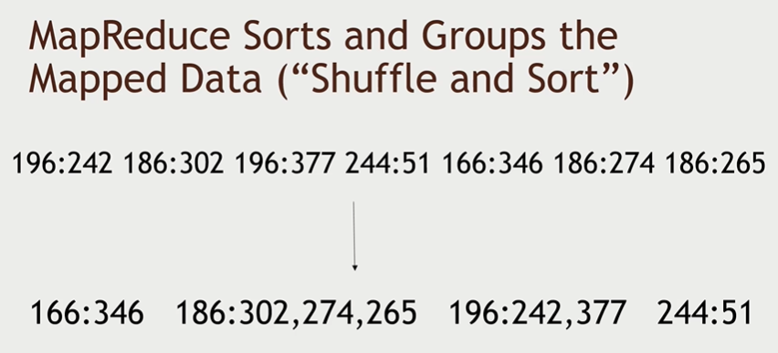
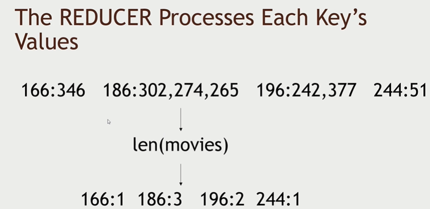
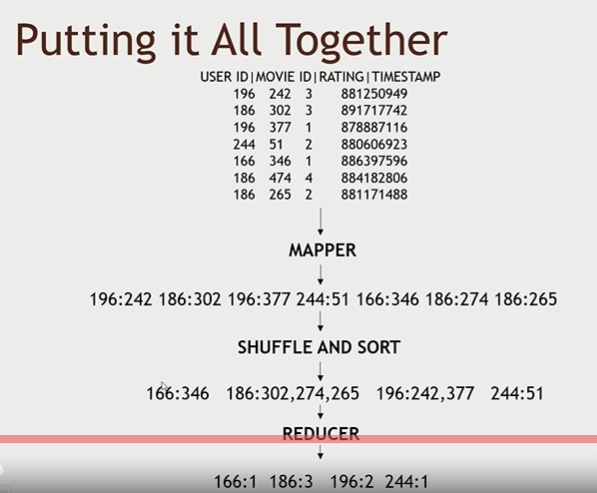
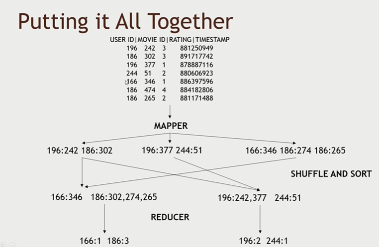
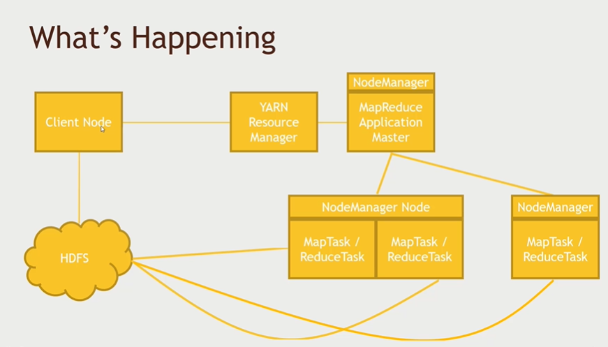

# [Section 2] MapReduce 를 이해해보자

## MapReduce

- 데이터에 대한 처리를 여러 컴퓨터로 분배한다.
- 데이터를 **map(==trasform) & reduce(==aggregate)해서 작은 partition으로** 나눈다.
    - **Mapper**
        - 1개의 인풋에 대해서 transform 해서 1개의 아웃풋을 만드는 것
        - Key-Value 형태로 묶는다.
    - **Reducer**
        - mapper로 묶인 데이터에 대해서 aggregate

- 장애 복구
    - application master 가 각 partition 의 mapper와 reducer 에 대해서 모니터한다.

<br>

## MapReduce의 작동방식을 추상적으로 이해해보자

1. **Mapping 작업**
    - input data에 대해 **mapper가 Key-Value 쌍으로 transform** 한다.

2. **Shuffle & Sort**
    - mapping 한 데이터에 대해  같은 Key라면 **묶고**, Key값을 기준으로 섞어서 **sorting**한다.

    

3. **Reduce 작업**
    - mapping 한 데이터에 대해서 **원하는 결과로 aggregate** 한다.
    
    

<br>

## MapReduce의 실제 클러스터에서의 작동방식을 이해해보자

- one node 일때의 mapreduce
    
    

- 실제처럼 **여러개의 node** 일때의 mapreduce

    
    
    - 클러스터가 3개의 노드로 이루어져 있다면, 3개의 노드에 데이터를 **쪼개서** 할당하고 각자 **병렬적으로 mapping, shuffle & sort, reduce job이 분산처리**된다.

    - 해당 사진 예제는 2개의 reducers
    - 마지막 reduce된 결과는 클라이언트 노드에게

<br>

### 무슨 일이 벌어지나? MapReduce Flow



1. client🙋‍♀️ "나 클러스터에서 map reduce job 하고 싶어 누가 available 한지 알려줘"
-> to **YARN 리소스 매니저**

2. client🙋‍♀️ "이 데이터 셋으로 map reduce job할꺼니까 데이터 저장해줘"
-> to HDFS

3. **Node Manager** 아래에 있는 **MapReduce Application Master** with **YARN 리소스매니저**👩‍🔧
"map reduce 작업을 분배해줄게" -> to cluster

4. cluster 의 node👩‍💻 "map reduce job 에 필요한 데이터셋 줘" -> to HDFS

5. cluster 의 node👩‍💻 "map reduce job 끝났으니까 결과 저장해줘" -> to HDFS

<br>

## MapReduce는 뭐로 개발할 수 있나

- natively Java
- **Streaming** 을 사용하면 Python 등으로도 개발할 수 있다.
    - 하둡 Streaming 이란?
        - 스크립트 언어를 하둡에서 실행하게 해주는 인터페이스
        - 맵리듀스가 데이터를 한번에 batch 처리하는 개념이었다면,
        - Streaming은 그때그때 데이터를 처리해야할 필요가 있을때 많이 사용
        - 예시 Streaming 코드
        ```linux
        > hadoop jar hadoop-streaming-1.2.1.jar \
	    -input 입력경로 \
	    -output 출력경로 \
	    -mapper 매퍼소스
	    -reducer 리듀서코드
        ```


<br>

## MapReduce의 장애 처리

- **Application Manager**
    - 워크들의 task를 모니터하고 있다가 죽으면 restart 하거나 다른 노드에게 task 다시 할당

- **YARN**
    - Application Manager 가 죽으면 restart시킴
    - 전체 노드가 비정상일 경우도 restart 시킴

- **Zookeeper**
    - YARN 도 죽었을 경우 **HA(High Availablility)** 를 사용해서 **hot stanby 하고 있는 second backup 리소스 매니저로** 바꿔줌 

<br>

### 🤔 MapReduce는 현재 Spark 와 같은 기술들로 대체되어지고 있기도 한다. 

<br>


## Reference
- https://www.slideshare.net/HyeonSeokChoi/ch6-25777029
- https://operatingsystems.tistory.com/entry/Hadoop-Streaming-API
- https://jyoondev.tistory.com/58
- https://12bme.tistory.com/154